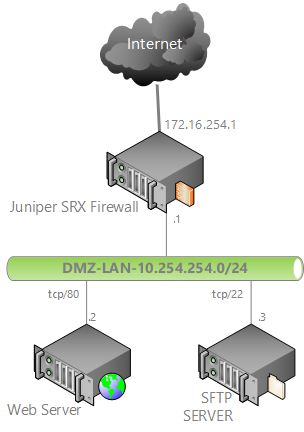

source: [https://doittherightway.wordpress.com/2013/03/07/juniper-srx-port-forwarding-destination-nat/](https://doittherightway.wordpress.com/2013/03/07/juniper-srx-port-forwarding-destination-nat/)

## Within this post I would like to explain how to set up port forwarding/ destination NAT using CLI on Jupier SRX 240 running JUNOS Software Release \[10.0R3.10\]

We will forward port tcp/80 over to Web Server and port tcp/22 over to SFTP Server:

172.16.254.1:80 -> 10.254.254.2:80

172.16.254.1:22 -> 10.254.254.3:22

Below drawing shows network topology:

#### First of all we have to configure address book entries:

set security zones security-zone DMZ-trust address-book address WebServer 10.254.254.2/32
set security zones security-zone DMZ-trust address-book address SftpServer 10.254.254.3/32

#### Pre-translated ports configuration:

set applications application HTTP protocol tcp
set applications application HTTP destination-port 80
set applications application SSH protocol tcp
set applications application SSH destination-port 22

#### NAT pool configuration,

#### both servers and ports are defined with their private IP addresses:

set security nat destination pool dnat\_10\_254\_254\_2m32 address 10.254.254.2/32 port 80
set security nat destination pool dnat\_10\_254\_254\_3m32 address 10.254.254.3/32 port 22

#### NAT Policy which specifies NAT pool that traffic will be translated to with destination port and IP address

set security nat destination rule-set DEST-NAT from zone untrust

##### Web Server

set security nat destination rule-set DEST-NAT rule WEB-SERVER-TCP-80 match destination-address 172.16.254.1/32
set security nat destination rule-set DEST-NAT rule WEB-SERVER-TCP-80 match destination-port 80
set security nat destination rule-set DEST-NAT rule WEB-SERVER-TCP-80 then destination-nat pool dnat\_10\_254\_254\_2m32

##### SFTP Server

set security nat destination rule-set DEST-NAT rule SFTP-SERVER-TCP-22 match destination-address 172.16.254.1/32
set security nat destination rule-set DEST-NAT rule SFTP-SERVER-TCP-22 match destination-port 22
set security nat destination rule-set DEST-NAT rule SFTP-SERVER-TCP-22 then destination-nat pool dnat\_10\_254\_254\_3m32

#### Security Policy configuration, private IPs and ports of Web Server and SFTP Server are defined here:

##### Web Server

set security policies from-zone untrust to-zone DMZ-trust policy INTERNET-TO-DMZ match source-address **any**
set security policies from-zone untrust to-zone DMZ-trust policy INTERNET-TO-DMZ match destination-address WebServer
set security policies from-zone untrust to-zone DMZ-trust policy INTERNET-TO-DMZ match application HTTP
set security policies from-zone untrust to-zone DMZ-trust policy INTERNET-TO-DMZ then permit

##### SFTP Server

set security policies from-zone untrust to-zone DMZ-trust policy INTERNET-TO-DMZ match source-address **any**
set security policies from-zone untrust to-zone DMZ-trust policy INTERNET-TO-DMZ match destination-address SftpServer
set security policies from-zone untrust to-zone DMZ-trust policy INTERNET-TO-DMZ match application SSH
set security policies from-zone untrust to-zone DMZ-trust policy INTERNET-TO-DMZ then permit

### UPDATE !

#### Missing source nat

set security nat source rule-set DMZ-TO-INTERNET from zone DMZ-trust
set security nat source rule-set DMZ-TO-INTERNET to zone untrust

set security nat source rule-set DMZ-TO-INTERNET rule DMZ-TO-INTERNET match source-address 10.254.254.2/32
set security nat source rule-set DMZ-TO-INTERNET rule DMZ-TO-INTERNET match source-address 10.254.254.3/32
 
set security nat source rule-set DMZ-TO-INTERNET rule DMZ-TO-INTERNET match destination-address 0.0.0.0/0
 
set security nat source rule-set DMZ-TO-INTERNET rule DMZ-TO-INTERNET then source-nat interface

## Juniper, as all firewalls, network appliances, routers, switches, load balancers, servers, IP Phones, you name it… when configured properly provides enough logs to start troubleshooting !

Read the logs !