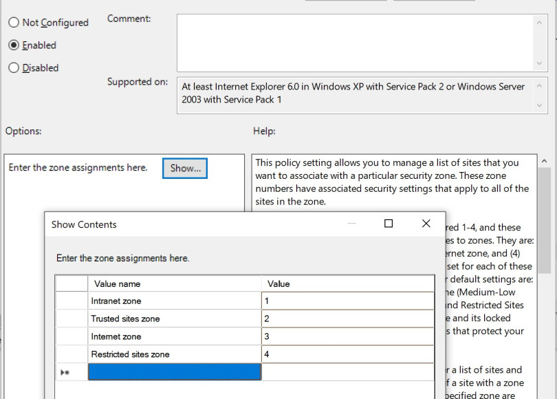
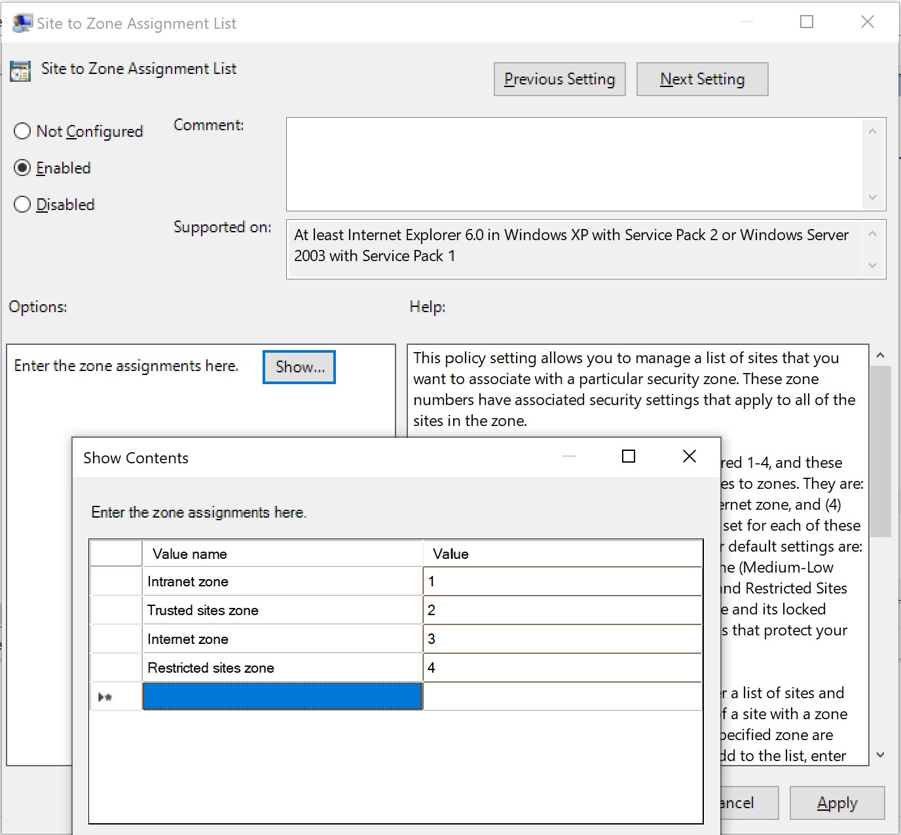
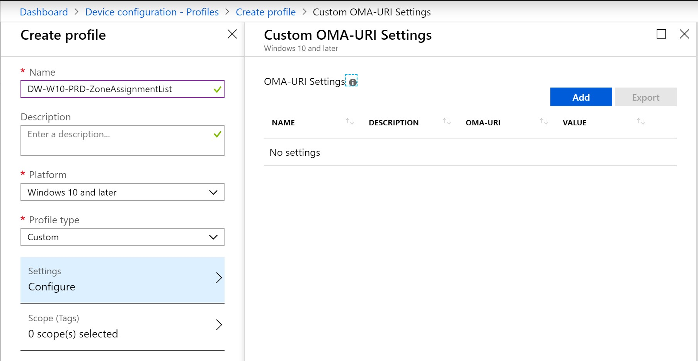
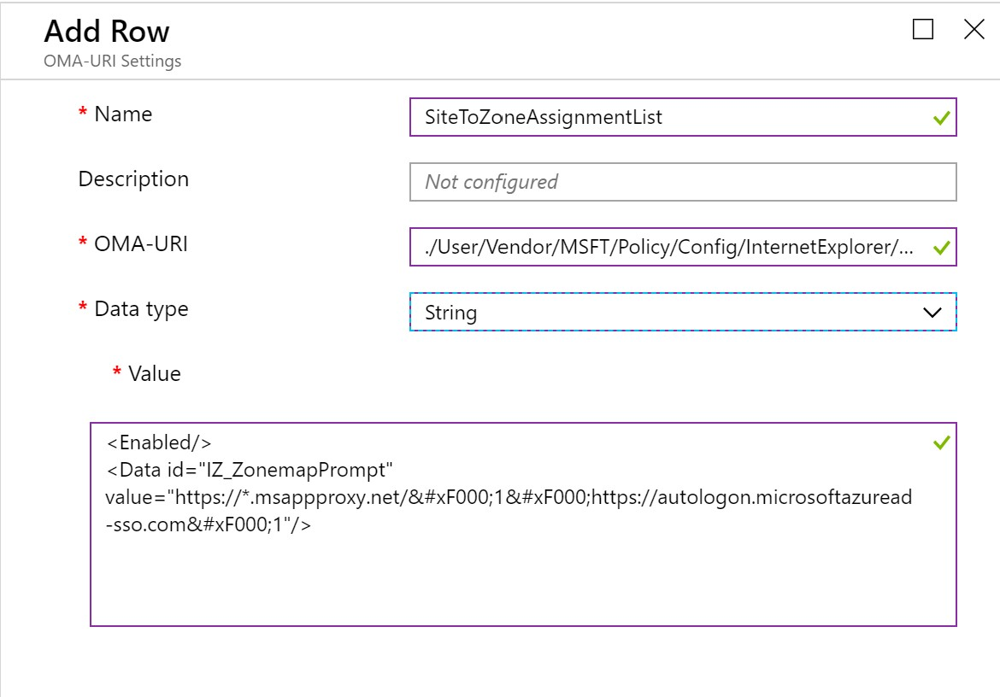
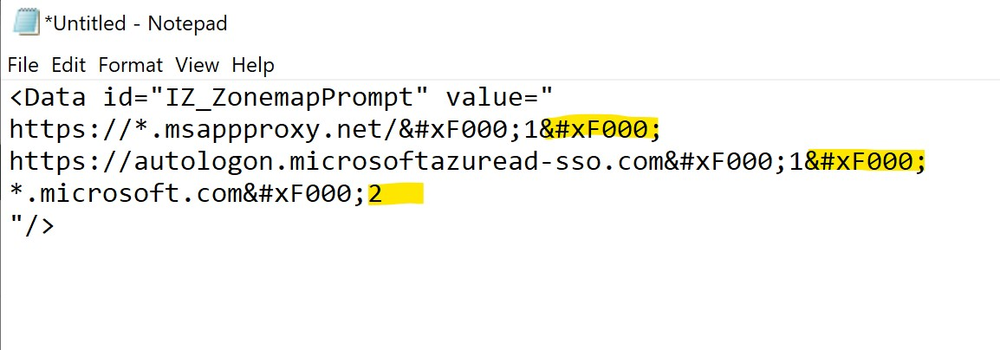

source: [https://deploywindows.com/2019/05/13/complete-guide-to-trusted-sites-with-intune/](https://deploywindows.com/2019/05/13/complete-guide-to-trusted-sites-with-intune/)

Are you looking for a way to handle your Zone assignment list for Internet Explorer with Intune? I wouldn’t recommend to handle that with PowerShell script, *Unless* you need to keep the configuration option open to users. But if you looking direct replacement for the old fashion group policy settings – this is your way!

Old fashion group policy setting: Site to Zone Assignment list

## Create device configuration profile

I will get right to it, so fire up your Intune portal.  
Start by adding a new Device Configuration Profile, with the type of **Windows 10** and **Custom**.

Custom Windows 10 device configuration profile

Press Settings, and Add a new OMA-URI row on the right and enter the following information

|     |
| --- |
| Name |
| **SiteToZoneAssignmentList** |
| OMA-URI |
| **./User/Vendor/MSFT/Policy/Config/InternetExplorer/AllowSiteToZoneAssignmentList** |
| Value |

(Note! If you do copy and paste, double check with the picture below, WordPress doesn’t handle the &­#xF000 very good)

New OMA-URI row

Press OK, OK, and Create to add the profile and then assign it to a group that fits you.

## Add another site to the list

This is a bit tricky, but just be careful, especially when it comes to very long lists. The list you just added contains two URLs in the intranet zone. Let’s break it down.  
This is one row  
**[https://*.msappproxy.net/&­#xF000;1](https://*.msappproxy.net/&­#xF000;1)**

|     |     |
| --- | --- |
| This is the URL | [https://*.msappproxy.net](https://*.msappproxy.net) |
| This is a divider for the next column or row | &­#xF000; |
| Explains what zone | 1 = Intranet   2 = Trusted   3 = Internet   4 = Restricted |

To if you want to add *.microsoft.com to the trusted list, it will look like this  
*.microsoft.com&­#xF000;2

And the complete value, don’t forget to add &­#xF000; as the divider as well to add new row

## Keep this in mind

I always keep two copies of this profile, one for test and one for production to make sure my changes always works, and nothing breaks.

It’s easy to forget or miss the dividers, sometimes I use notepad to make sure everything is correct. Note that the last row never ends with a divider

This configuration will add the configuration to the user profile, if you need to create the entries per-computer instead that possible, just change the URI to ./Device/Vendor/ instead of ./User/Vendor  
In some rare cases you could omit Device or User, and just write ./Vendor. Generally I don’t recommend it, try to specify User or Device when possible.  
See reference for more information

## Reference

[Policy CSP – Site to Zone assignment list](https://docs.microsoft.com/en-us/windows/client-management/mdm/policy-csp-internetexplorer#internetexplorer-allowsitetozoneassignmentlist)