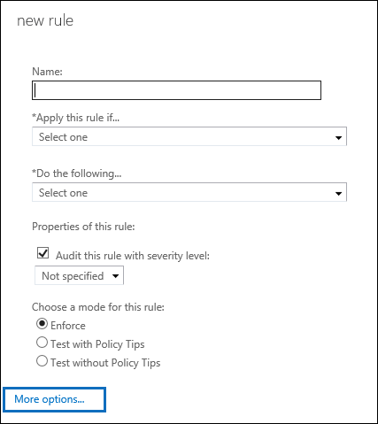
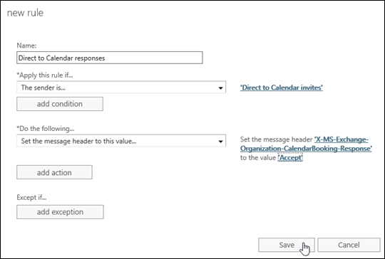
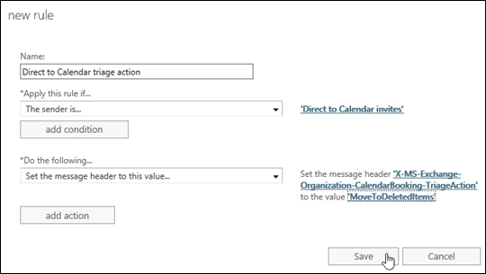

---
title: Use mail flow rules to automatically add meetings to calendars in Exchange Online
zid: KB-202008041536
category: kb
tags:
- #mail
- #calendar
- #office365
- #exchange online
---

source: [https://docs.microsoft.com/en-us/exchange/security-and-compliance/mail-flow-rules/use-rules-to-add-meetings](https://docs.microsoft.com/en-us/exchange/security-and-compliance/mail-flow-rules/use-rules-to-add-meetings)

- 02/08/2020
- 5 minutes to read

### In this article

1.  [What do you need to know before you begin?](#what-do-you-need-to-know-before-you-begin)
2.  [Use the Exchange admin center to create Direct to Calendar mail flow rules](#use-the-exchange-admin-center-to-create-direct-to-calendar-mail-flow-rules)
3.  [Use Exchange Online PowerShell to create Direct to Calendar mail flow rules](#use-exchange-online-powershell-to-create-direct-to-calendar-mail-flow-rules)
4.  [How do you know this worked?](#how-do-you-know-this-worked)
5.  [More information](#more-information)

With the Direct to Calendar feature in Exchange Online, administrators can configure mail flow rules (also known as transport rules) that allow designated users to add meetings to calendars. The benefits of Direct to Calendar are:

- The event is automatically added to the recipient's calendar without any action from them. If the user received the meeting invitation, it's on their calendar.
    
- The sender doesn't need to deal with Out of Office or other unwanted response messages that result from sending meeting invitations to a large number of recipients.
    
- No meeting-related messages are seen by attendees unless the meeting is cancelled.
    

Direct to Calendar requires two mail flow rules with specific conditions and actions. These rules are described in the following table:

For more information about mail flow rules, see [Mail flow rules (transport rules) in Exchange Online](https://docs.microsoft.com/en-us/exchange/security-and-compliance/mail-flow-rules/mail-flow-rules).

## What do you need to know before you begin?[](#what-do-you-need-to-know-before-you-begin)

- Estimated time to complete: 10 minutes
    
- You need to be assigned permissions before you can perform this procedure or procedures. To see what permissions you need, see the "Mail flow" entry in the [Feature permissions in Exchange Online](https://docs.microsoft.com/en-us/exchange/permissions-exo/feature-permissions) topic.
    
- The designated accounts for sending Direct to Calendar meeting invitations need to exist.
    
- For more information about opening and using the Exchange admin center (EAC), see [Exchange admin center in Exchange Online](https://docs.microsoft.com/en-us/exchange/exchange-admin-center).
    
- To learn how to connect to Exchange Online PowerShell, see [Connect to Exchange Online PowerShell](https://go.microsoft.com/fwlink/p/?linkid=396554).
    
- For information about keyboard shortcuts that may apply to the procedures in this topic, see [Keyboard shortcuts for the Exchange admin center](https://docs.microsoft.com/en-us/exchange/accessibility/keyboard-shortcuts-in-admin-center).
    

## Use the Exchange admin center to create Direct to Calendar mail flow rules[](#use-the-exchange-admin-center-to-create-direct-to-calendar-mail-flow-rules)

1.  In the EAC, go to **Mail flow** \> **rules**.
    
2.  Click **New** ( ), and then select **Create a new rule**.
    
3.  In the **New rule** page that opens, click **More options**.
    
    
    
4.  Configure these additional settings on the **New rule** page:
    
    - **Name**: Direct to Calendar response (or anything descriptive).
        
    - **Apply this rule if** \> **The sender** \> **is this person**: Select one or more users to send Direct to Calendar meeting invitations.
        
    - **Do the following** \> **Modify the message properties** \> **set a message header**: Enter the following values:
        
    - **Set the message header** `X-MS-Exchange-Organization-CalendarBooking-Response`
        
    - **to the value** `Accept`
        
    
    When you're finished, click **Save**.
    
    
    
5.  Back at **Mail flow** \> **Rules**, click **New** ( ) again, and then select **Create a new rule**.
    
6.  In the **New rule** page that opens, click **More options**.
    
    
    
7.  Configure these additional settings on the **New rule** page:
    
    - **Name**: Direct to Calendar triage action (or anything descriptive).
        
    - **Apply this rule if** \> **The sender** \> **is this person**: Select the same users as in step 3.
        
    - **Do the following** \> **Modify the message properties** \> **set a message header**: Enter the following values:
        
    - **Set the message header** `X-MS-Exchange-Organization-CalendarBooking-TriageAction`
        
    - **to the value** `MoveToDeletedItems`
        
    
    When you're finished, click **Save**.
    
    
    

## Use Exchange Online PowerShell to create Direct to Calendar mail flow rules[](#use-exchange-online-powershell-to-create-direct-to-calendar-mail-flow-rules)

1.  To create the mail flow rule that turns regular meeting invitations into Direct to Calendar meeting invitations, use the following syntax:
    
    ```
    New-TransportRule -Name "Direct to Calendar response" -From "<designated sender 1>","<designated sender 2>"... -SetHeaderName "X-MS-Exchange-Organization-CalendarBooking-Response" -SetHeaderValue Accept
    
    ```
    
    This example configures the rule using the dedicated mailbox named Direct to Calendar invites.
    
    ```
    New-TransportRule -Name "Direct to Calendar response" -From "Direct to Calendar invites" -SetHeaderName "X-MS-Exchange-Organization-CalendarBooking-Response" -SetHeaderValue Accept
    
    ```
    
2.  To create the mail flow rule that prevents Direct to Calendar meeting invitations from appearing in the Inbox of recipients, use the following syntax:
    
    ```
    New-TransportRule -Name "Direct to Calendar triage action" -From "<designated sender 1>","<designated sender 2>"... -SetHeaderName "X-MS-Exchange-Organization-CalendarBooking-TriageAction" -SetHeaderValue MoveToDeletedItems
    
    ```
    
    This example configures the rule using the dedicated mailbox named Direct to Calendar invites.
    
    ```
    New-TransportRule -Name "Direct to Calendar triage action" -From "Direct to Calendar invites" -SetHeaderName "X-MS-Exchange-Organization-CalendarBooking-TriageAction" -SetHeaderValue MoveToDeletedItems
    
    ```
    

For detailed syntax and parameter information, see [New-TransportRule](https://docs.microsoft.com/powershell/module/exchange/policy-and-compliance/new-transportrule).

## How do you know this worked?[](#how-do-you-know-this-worked)

To verify that you have successfully configured Direct to Calendar meeting invitations, use the designated sender mailbox to send a test meeting invitation to a small number of recipients. Verify that the meeting automatically appears in the calendars of the recipients, and verify there are no meeting-related messages in the Inbox (the second rule should automatically move these messages to the Deleted Items folder).

## More information[](#more-information)

- The designated sender mailbox will receive meeting acceptance responses to Direct to Calendar meetings. Use the following strategies to help minimize the impact of these messages on the designated sender:
    
    - In Outlook, enable the **Update tracking information, and then delete responses that don't contain comments** and **After updating tracking information, move receipt to &lt;Deleted Items&gt;** settings in **Mail** \> **Tracking** for the designated sender mailbox. For more information, see [Change how meeting requests, polls, and read or delivery receipts are processed](https://go.microsoft.com/fwlink/p/?linkid=847058).
        
    - Clearing the **Request Responses** setting in Direct to Calendar meeting invitations doesn't prevent responses from being sent back to the designated sender mailbox.
        
- If the designated mailbox sends a meeting cancellation for a Direct to Calendar meeting, the cancelled meeting title is always changed to **CANCELED: &lt;previous meeting title&gt;**, and the cancelled meeting remains in the calendars of attendees until they manually remove it.
    
- Meeting cancellation messages for Direct to Calendar meetings will always appear in the Inbox of recipients.
    

### Related Articles

## Feedback

There are no closed issues