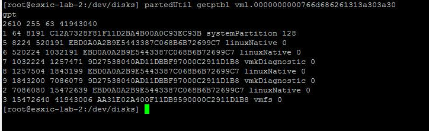

source: [http://www.vmwarearena.com/what-i-wish-everyone-knew-about-esxi-partition/](http://www.vmwarearena.com/what-i-wish-everyone-knew-about-esxi-partition/)

We all are almost familiar with the ESXi installation procedure. Have you ever noticed or prompted to define the partition table information during ESXi installation ?. I don’t think so. When you install ESXi, We do not get the opportunity to modify the partition layout, Partitions will be automatically set by the installation process. Let’s take this article as the opportunity to take a deep look at the ESXi Partition. For this article, I will be explaining the ESXi partition information  about [ESXi 6.5](http://www.vmwarearena.com/category/esxi-6-5/).  Take a look at my article to understand [VCSA 6.5 partitions and mount points](http://www.vmwarearena.com/understanding-vcsa-6-5-vmdk-partitions-mount-points/). There are no changes in the partition table as compared to ESXi 6.0 and [ESXi 6.5](http://www.vmwarearena.com/category/esxi-6-5/). From ESXi 5.X, older MBR partitioning system is replaced with a GPT style partition table. Let’s take a look at ESXi partition table.

## **How to Check ESXi Partition Information**

For ESXi 5.0 or later, You can use partedUtil to get the partition information. fdisk command can be used in the previous versions of ESXi. First we need to identify the disk that we will examine further with partedUtil. We can do this by listing the contents of /dev/disks

``ls /dev/disks -lh``

You can easily identify the ESXi installed disk. ESXi installation disk will the be disk with multiple partitions. You can noticed disks which are in Green color  are the ESXi installed disk.

You can now use “partedUtil” to examine the partition table of that particular disk. Use the below command to get the partition table information

``partedUtil getptbl vm1.0000000000766d686261313a303a30``

You can compare the above two output to get the size information about the each of the partition 

### **Understand ESXi Partition Information**

Below the various ESXi partitions:

- Partition 1: systemPartition -> Bootloader Partition (4MB )
- Partition 5: linuxNative  -> /bootbank (250MB)
- Partition 6: linuxNative -> /altbootbank ( 250MB)
- Partition 7: vmkDiagnostic  -> First Diagnostic Partition (110MB)
- Partition 8: linuxNative  -> /store (286MB)
- Partition 9: vmkDiagnostic -> Second Diagnostic Partition ( 2.5 GB)
- Partition 2: linuxNative  -> /scratch (4GB)
- Partition 3: VMFS datastore

**Partition 1:  Bootloader Partition (4MB)**

This Partition is needed for Booting. Which is 4 MB in size (System Partition)

**Partition 5:  Bookbank (250MB)**

The hypervisor image is located on this 250 MB partition. It is formatted with old FAT.  The image is called s.v00 (124MB compressed) and is decompressed during boot. It will be extracted during the boot process and loaded into the system memory.

**Partition 6:  /altbootbank (250 MB)**

/altbootbank partition is empty after a fresh installation of ESXi server. Below is the Example of contents of /altbootbank partition on the fresh install ESXi Server.

Once you perform an upgrade of ESXi host , the current image is copied from the bootbank partition. This makes the possibility to  return to the previous version of ESXi  (last known good configuration) by typing “Shift + R” while booting,  if there any issues occurred during the ESXi host upgrade. Below is the Example of contents of /altbootbank partition on the Upgraded ESXi Server. It contains around 138 files in the directory. Take a look at my article [How to Downgrade or Rollback your failed ESXi 6 upgrade to previous Version](http://www.vmwarearena.com/how-to-downgrade-or-rollback-your-failed-esxi-6-upgrade-to-previous-version/)

**Partition 7: vmkDiagnostic (110 MB) – First Diagnostic Partition**

In case of ESXi Crash or [PSOD](http://www.vmwarearena.com/esxi-psod-esxi-host-fails-intermittent-nmi-psod-hp-proliant-gen8-servers/), host dump file written on this partition

**Partition 8: /store (286 MB)**

This /store partition contains various [ISO files for the VMware Tools](http://www.vmwarearena.com/manually-download-vmware-tools-iso-image/) for all supported operating systems. When you install  the [VMware Tools](http://www.vmwarearena.com/manually-download-vmware-tools-iso-image/) on the Virtual machine, [VMware tools ISO](http://www.vmwarearena.com/manually-download-vmware-tools-iso-image/) will get mounted to the CD/DVD drive of virtual machine from this location.

**Partition 9: Second Diagnostic Partition (2.5 GB)**

Second Diagnostic partition is 2.5 GB as addition to the vmkDiagnostic partition (110 MB in size) . Using [ESXCLI](http://www.vmwarearena.com/quick-tip-how-to-format-the-output-of-esxcli-command/) command, you can check the current status of active diagnostic partition, as we have two diagnostic partitions.

esxcli system coredump partition list

**Partition 2:  /scratch (4 GB)**

The [scratch partition](http://www.vmwarearena.com/how-to-configure-scratch-partition-in-vmware-esxi-using-web-client/) is a 4 GB VFAT partition that is created to store vm-support output, which is needed to analyse the cause of system failures and which is needed by VMware Support to identify and [troubleshoot](http://www.vmwarearena.com/category/troubleshooting/) the issues occurred on ESXi host . If the scratch partition is not present, [vm-support](http://www.vmwarearena.com/esxtop-replay-mode/)output is stored in a ramdisk. It will be lost after the system reboot. Take a look at my article How to [configure persistent Scratch partition in VMware ESXi](http://www.vmwarearena.com/how-to-configure-scratch-partition-in-vmware-esxi-using-web-client/). This partition will be created only when you have free space of more than 5 GB on the ESXi local disk.

**Partition 3: VMFS datastore**

This partition is only created, if the installation medium is not a flash memory. VMFS partition extends over the total available unallocated space of the disk  and is formatted it with VMFS 5/VMFS 6 based on the ESXi version and selection. It is also referred as “[Datastores](http://www.vmwarearena.com/?s=datastore)“.

That’s it. I hope this article will help you to get the detailed understanding about ESXi partitions. Thanks for Reading!!. Be social and share it in social media using Social media sharing options, If you feel worth sharing it.